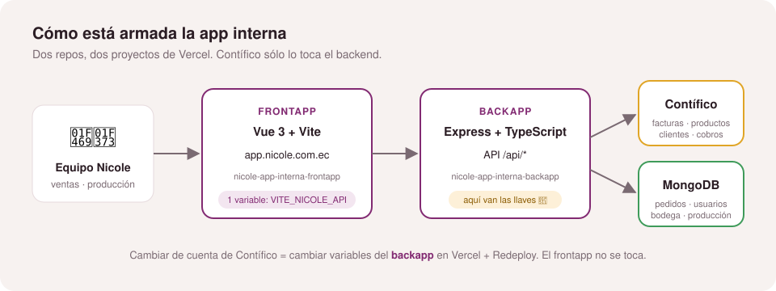

<div align="center">

# 🧁 App interna · Nicole Pastry Arts — **Frontapp**

**La app que usa el equipo: pedidos, facturas, producción, POS y bodega.**

[](https://app.nicole.com.ec)
[](https://vercel.com/proyectos-de-diego/nicole-app-interna-frontapp)
[](https://github.com/yeyodev1/nicole-app-interna-backapp)


</div>

---

## 🔗 Todo en un solo lugar

| | Frontapp (este repo) | Backapp |
|---|---|---|
| **GitHub** | [yeyodev1/nicole-app-interna-frontapp](https://github.com/yeyodev1/nicole-app-interna-frontapp) | [yeyodev1/nicole-app-interna-backapp](https://github.com/yeyodev1/nicole-app-interna-backapp) |
| **Vercel** | [nicole-app-interna-frontapp](https://vercel.com/proyectos-de-diego/nicole-app-interna-frontapp) | [nicole-app-interna-backapp](https://vercel.com/proyectos-de-diego/nicole-app-interna-backapp) |
| **URL producción** | **https://app.nicole.com.ec** | https://nicole-order-backapp.vercel.app |

<p align="center">
  
</p>

## 🔑 ¿Quieres cambiar la cuenta de Contífico?

**No es aquí.** Las llaves de Contífico van en el **backapp**. Guía paso a paso con capturas:
👉 **[Conectar otra cuenta de Contífico](https://github.com/yeyodev1/nicole-app-interna-backapp#-conectar-otra-cuenta-de-contífico-en-3-pasos)**

Este repo sólo tiene una variable:

| Variable | Qué es | Valor en producción |
|---|---|---|
| `VITE_NICOLE_API` | URL de la API (backapp) | `https://nicole-order-backapp.vercel.app/api` |

> No es secreta: queda dentro del bundle que descarga el navegador. Ya viene en `.env.production`.

---

## 👥 Quién ve qué

| Rol | Secciones |
|---|---|
| Ventas | Pedidos, reportes |
| Producción | Producción |
| Retail Manager | POS |
| Supply Chain | Bodega, proveedores, sobrantes |

## 🚀 Cómo se despliega

```
develop  ──push──►  Preview en Vercel
   │
   └── PR a main ──merge──►  app.nicole.com.ec (automático, ~20 s)
```

## 💻 Correr en local

```sh
pnpm install
pnpm dev          # usa VITE_NICOLE_API (por defecto http://localhost:8101/api)
pnpm build        # type-check + build de producción
```

Stack: Vue 3 (`<script setup>`) · TypeScript · Vite · Pinia · Vue Router · SCSS. Más detalle en [`CLAUDE.md`](CLAUDE.md).

---

<div align="center"><sub>Hecho por <a href="https://bakano.ec">Bakano</a> para Nicole Pastry Arts 🧁</sub></div>
